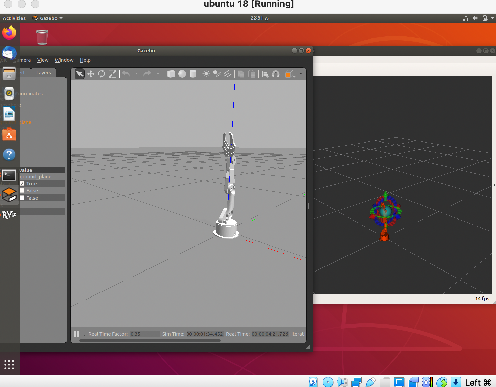

# Robot_arm_packages

this to show the steps of installing Ros & [arduino robot arm](https://github.com/smart-methods/arduino_robot_arm) packages

## Steps

#### installing Ros
```
$ sudo sh -c 'echo "deb http://packages.ros.org/ros/ubuntu $(lsb_release -sc) main" > /etc/apt/sources.list.d/ros-latest.list'
$ curl -s https://raw.githubusercontent.com/ros/rosdistro/master/ros.asc | sudo apt-key add -
$ sudo apt update
$ sudo apt install ros-melodic-desktop-full
$ echo "source /opt/ros/melodic/setup.bash" >> ~/.bashrc
$ source ~/.bashrc
$ gedit ~/.bashrc "to delete /opt/ros/kinetic/setup.bash"
$ sudo apt install python-rosdep python-rosinstall python-rosinstall-generator python-wstool build-essential
$ sudo apt install python-rosdep
$ sudo rosdep init
$ rosdep update
```

#### creating a workspace

```
$ source /opt/ros/meldoic/setup.bash
$ mkdir -p ~/catkin_ws/src
$ cd ~/catkin_ws/
$ catkin_make
$ echo "source ~/catkin_ws/devel/setup.bash" >> ~/.bashrc
$ source ~/.bashrc
```


#### installing the packages

```
 $ cd ~/catkin_ws/src
 $ sudo apt install git
 $ git clone https://github.com/smart-methods/arduino_robot_arm - Install all the dependencies 
 $ cd ~/catkin_ws
 $ rosdep install --from-paths src --ignore-src -r -y
 $ sudo apt-get install ros-melodic-moveit
 $ sudo apt-get install ros-melodic-joint-state-publisher ros-melodic-joint-state-publisher-gui
 $ sudo apt-get install ros-melodic-gazebo-ros-control joint-state-publisher
 $ sudo apt-get install ros-melodic-ros-controllers ros-melodic-ros-control -Compile the package
 $ catkin_make
```

#### to run 

```
$ roslaunch robot_arm_pkg check_motors.launch
$ roslaunch robot_arm_pkg check_motors_gazebo.launch
$ cd catkin/src/arduino_robot_arm/robot_arm_pkg/scripts
$ sudo chmod +x joint_states_to_gazebo.py
$ rosrun robot_arm_pkg joint_states_to_gazebo.py
```

## Result 


